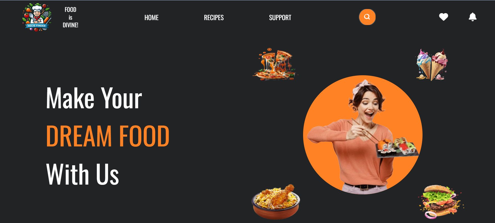
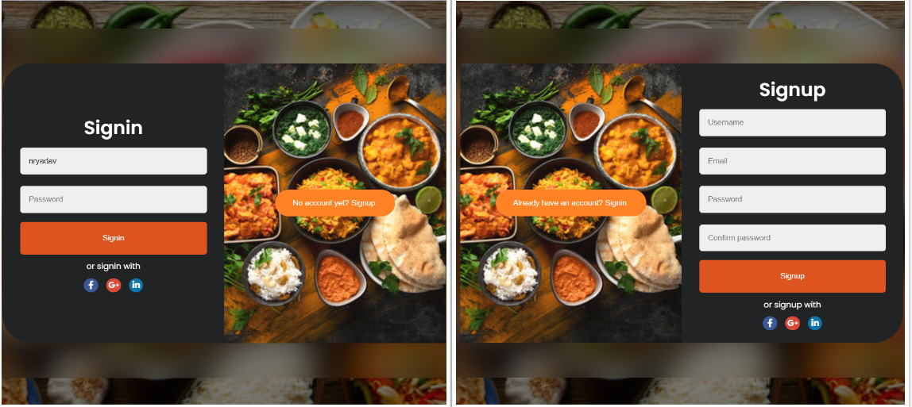
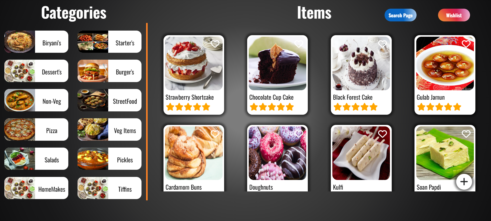
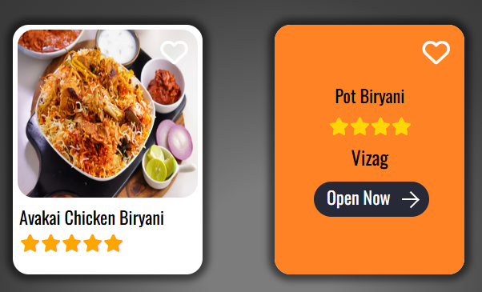
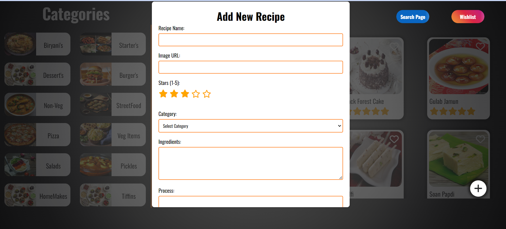
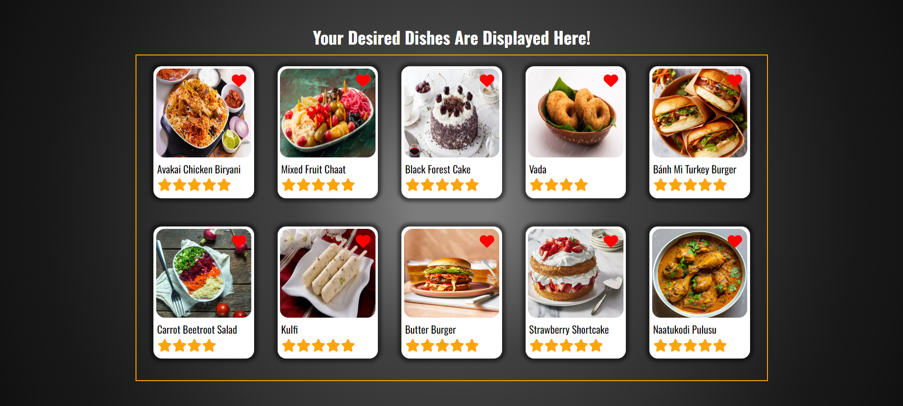
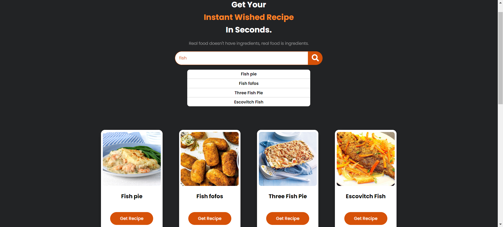
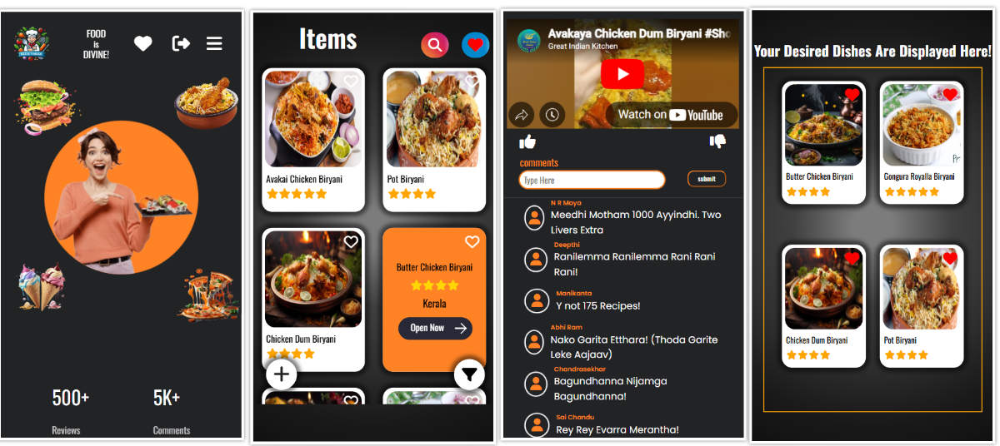

# 🍽️ RecipeFinder

RecipeFinder is a user-friendly web app for discovering, adding, and managing recipes. Users can browse recipes by category, view detailed instructions, and watch recipe videos for step-by-step guidance. Each recipe includes a clear procedure section, making it easy to follow along and cook new dishes. Admins can add new recipes with images, ingredients, process, and optional video links, ensuring a rich and interactive cooking experience for everyone.

## 🌐 Live Demo

**🔗 [Click here to view the live project](https://recipe-finder-two-murex.vercel.app/HomePage/RecipeFinder/home.html)**

## 🎬 Vedio Demo

**🔗 [Click here for Vedio Demo of the project](https://drive.google.com/file/d/1qWA0NdVnIIAqIPZbld_NlR3HyTvJt7gm/view?usp=sharing)**

---

## 🏠 Home Page

A vibrant landing page with a catchy logo, animated hero section, and easy navigation. Users are welcomed with highlights, testimonials, and quick access to all main features.

---

## 🔐 User Authentication

Secure login and signup for all users.  
- **Admins** have special access to add new recipes.
- **Regular users** can browse, search, and favorite recipes.

---

## 📚 Recipe Categories

Recipes are organized into visually appealing categories (Biryani's, Starters, Desserts, Pizza, etc.).  
Clicking a category displays all recipes under it, each with a representative image.

---

## 🍲 Recipe Cards

Each recipe is shown as a card with:
- Image
- Name
- Star rating
- Region
- "Favorite" heart icon
- "Open Now" button for details

---

## ➕ Add New Recipe (Admin Only)

Admins can add new recipes using a dedicated form.  
- Fields: Name, Image URL, Stars, Region, Ingredients, Process, Video URL, Category
- Form validation ensures data quality
- New recipes appear instantly in the selected category

---

## ❤️ Favorites & Wishlist

Users can favorite recipes and access their wishlist/cart for a personalized experience.

---

## 🔍 Search Functionality

Quickly find recipes by typing keywords in the search bar.  
Instant filtering by name or category.

---

## 👨‍🍳 Recipe Details

Detailed view for each recipe, including:
- Full image
- Name, rating, region
- Ingredients and process
- Optional video

---

## 📦 Persistent Storage

All data is stored in the browser using:
- **localStorage** for recipes and favorites
- **Cookies** for additional persistence

No backend required – everything runs in your browser!

---

## 📱 Responsive & Modern UI

- Fully responsive for desktop and mobile
- Smooth animations and transitions
- Uses Font Awesome icons and Google Fonts

---
This is a live project built using HTML, CSS & JavaScript with full authentication, real-time features, and a clean UI.

> 📌 The source code is private.  
> If you're interested in the code for collaboration, hiring, or learning, please contact me:

📧 saichanduadapa951@gmail.com  
📱 LinkedIn: [Saichandu Adapa](https://www.linkedin.com/in/saichandu-adapa-143b41254/)

---
### 🔐 Why is the code private?
This is an original project built with weeks of work and real-time functionality.  
To protect it from unauthorized use, the code is not publicly available.

